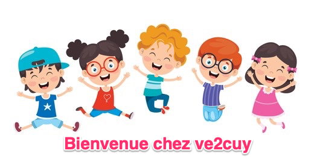

# VOUS ÊTES CHEZ VE2CUY

    

---
## Cours disponibles

[420-1C4 : Objets connectés](https://ve2cuy.github.io/4201c4/)

[420-3C3 : Installation de serveurs](https://ve2cuy.com/420-3c3/)

[420-4D4 : Déploiement de serveurs - Introduction à Docker et K8s](https://ve2cuy.github.io/4204d4/)

---

## Auteur

- Alain BOUDREAULT
- Enseignant au département de Techniques de l'Informatique
- Cégep de Saint-Jérôme
- Courriel: Aboudrea@cstj.qc.ca
- Téléphone: x6516
- Local: D125e
